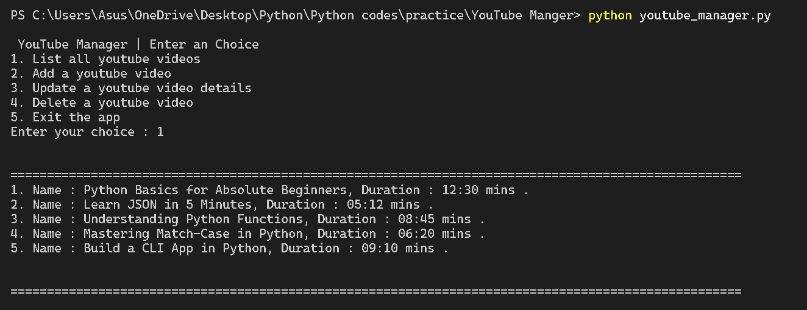

# YouTube Manager — Python CLI Application

## Overview

YouTube Manager is a command-line application developed using Python that allows users to manage basic information about YouTube videos.

The application provides functionality to add, list, update, and delete video records stored in a local JSON file. It demonstrates fundamental programming concepts such as file handling, JSON data manipulation, modular program design, and menu-driven CLI applications.

All data is stored locally and automatically persisted between program executions.

---

## Key Features

- Add new YouTube video records
- List all stored videos
- Update existing video information
- Delete video entries
- JSON-based persistent storage
- Automatic file creation if the storage file does not exist
- Simple menu-driven command-line interface

---

## Technology Stack

- Language: Python
- Storage: JSON file
- Interface: Command-Line Interface (CLI)

---

## Project Structure

```
youtube-manager/
│
├── youtube_manager.py    # Main application code
├── youtube.txt           # JSON file storing video records
└── README.md             # Project documentation
```

---

## Running the Application

### Requirements

Python 3.x installed

### Steps

Clone the repository:

```
git clone https://github.com/bhushanbhutada03/youtube-manager.git
```

Navigate to the project directory:

```
cd youtube-manager
```

Run the program:

```
python youtube_manager.py
```

---

## Application Menu

The program provides the following operations:

1. List all videos
2. Add a new video
3. Update video information
4. Delete a video
5. Exit the program

---

## Demo Screenshots

### Main Menu


### Listing Stored Videos



---

## Example Program Output

```
===== YouTube Manager =====

1. List videos
2. Add new video
3. Update video
4. Delete video
5. Exit

Enter choice: 1

Saved Videos:

1. Python Basics (12:30)
2. Learn JSON (05:12)
```

---

## Example Stored Data

Example JSON structure stored in `youtube.txt`:

```json
[
  {
    "name": "Python Basics",
    "time": "12:30"
  },
  {
    "name": "Learn JSON",
    "time": "05:12"
  }
]
```

The application reads and writes this JSON file to maintain persistent video records.

---

## Learning Outcomes

This project demonstrates practical understanding of:

- CLI-based Python application development
- File handling and persistent data storage
- JSON parsing and manipulation
- Menu-driven program design
- Basic CRUD operations (Create, Read, Update, Delete)

---

## Author

Bhushan Bhutada  
Computer Science Engineering Student

---

## Future Improvements

Possible enhancements include:

- Support for additional video metadata
- Search functionality
- Category-based organization
- Database-backed storage
- Graphical user interface (GUI)
